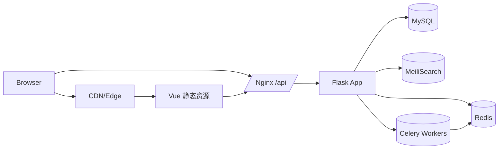
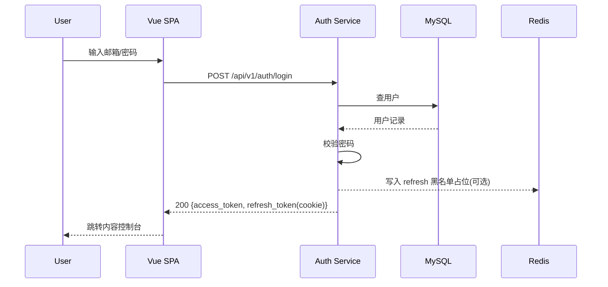
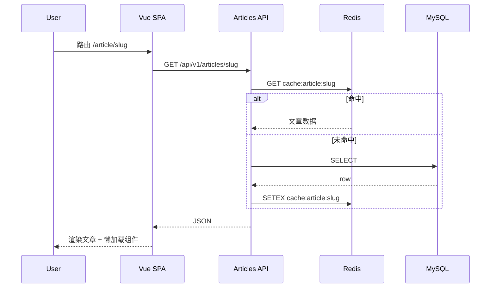
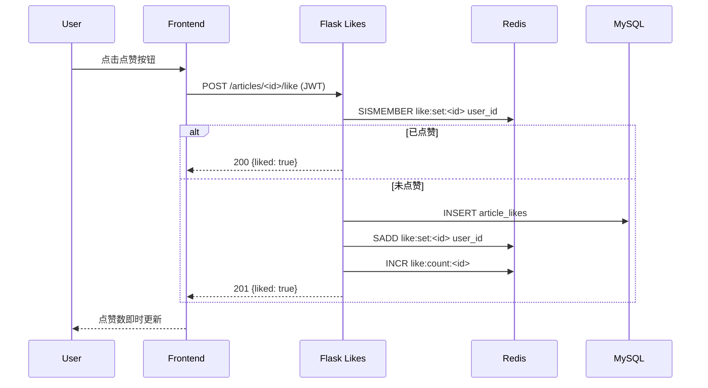
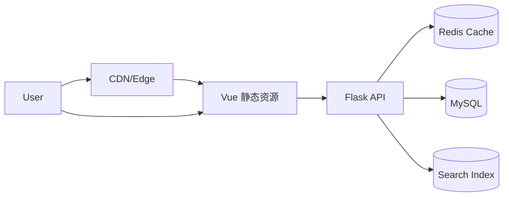

# 产品需求文档（PRD）— Flask 内容平台

## 1. 项目背景与目标
为内部作者团队建设一个现代化、高性能的内容创作与分发平台，兼顾：
- 高效创作（Markdown + WYSIWYG + 版本控制 + 发布调度）
- 优质阅读体验（性能 > 设计 > 可访问性）
- 可增长能力（SEO + API + 可扩展架构）
- 多端扩展准备（移动 / 小程序 / 外部聚合）

核心目标：提升内容生产效率、提升阅读与互动转化、建立结构化内容资产。

## 2. 角色与权限概览
- 管理员 Admin
- 编辑 Editor
- 作者 Author
- 读者 Reader（未登录/已登录普通用户）

## 3. 功能列表（Feature List）
1. 账户与权限：注册、登录、角色、访问控制、资料管理
2. 文章创作：Markdown WYSIWYG、图片上传压缩、视频/Gist 嵌入、代码高亮
3. 文章管理：草稿/待审核/已发布、版本历史与回滚、定时发布、SEO 字段、特色图片、分类 & 标签
4. 内容浏览：首页、分类页、标签页、作者主页、文章详情、相关推荐
5. 搜索：全文检索+模糊（Elasticsearch/MeiliSearch）
6. 评论系统：嵌套回复、审核、分页、敏感词过滤
7. 点赞与收藏：去重、用户收藏列表
8. 通知（预留）：审核结果、计划发布提醒
9. 统计（基础）：浏览、点赞、评论计数
10. 公共只读 REST API：文章、分类、标签、作者
11. 媒体处理：图片压缩、懒加载、特色图裁剪
12. 性能优化：静态打包、缓存、分页
13. 安全：CSRF、XSS、SQL 注入防护、速率限制
14. 部署：云服务器 + Nginx + Gunicorn/uWSGI
15. 架构与扩展：Blueprint 模块化、搜索适配层
16. 前端 SPA：基于 Vue3 + Vite + Vue Router + Pinia；可选 Nuxt3（SSR/预渲染）提升 SEO

## 4. 用户故事（User Stories）
- 作为管理员，我想管理用户角色，以便控制平台安全。
- 作为编辑，我想审核作者投稿，以保障内容质量。
- 作为作者，我想回滚旧版本，以避免误操作损失。
- 作为作者，我想设置未来发布时间，以便配合活动。
- 作为作者，我想填写 SEO 信息，以提升搜索曝光。
- 作为读者，我想按标签筛选文章，以快速找到兴趣内容。
- 作为读者，我想收藏文章，以便稍后阅读。
- 作为读者，我想看到代码高亮，以提升阅读体验。
- 作为评论者，我想回复他人评论，以便展开讨论。
- 作为编辑，我想查看文章互动数据，以评估推广效果。
- 作为移动端开发者，我想通过公开 API 获取文章列表，以构建客户端。
- 作为运营，我想确保页面加载高分，以提升留存。

## 5. 功能详述
### 5.1 权限与认证（前后端分离调整）
- 认证模式：用户名/邮箱 + 密码 -> 返回 JWT（Access Token 短期） + Refresh Token（httpOnly Cookie 或安全存储）
- Access Token：默认 15~30 分钟有效，放在 Authorization: Bearer 头；Refresh Token：7~30 天（httpOnly + SameSite=Lax）
- 刷新流程：前端检测即将过期 -> 调用 /auth/refresh -> 颁发新 Access Token
- 登出：后端将 Refresh Token 加入黑名单（Redis 设置 TTL）并前端清除本地状态
- CSRF：如使用 cookie 承载 access 需双令牌（Cookie + Header X-CSRF-Token）；若前端只用 Bearer 头则降低 CSRF 风险
- 授权：后端基于 JWT 内角色 + 资源所有权校验；细粒度装饰器保持 (@role_required 等)
- 失败状态码：401 未认证 / 403 权限不足

### 5.2 文章生命周期
- 状态：draft -> pending -> published（编辑审核）
- 字段：title, slug, content_md/html, summary, seo_title, seo_description, featured_image, category_id, tags[], scheduled_at, published_at
- Slug：自动生成，可手动覆盖；唯一性校验
- 定时发布：scheduled_at 到达由定时任务发布
- 删除：逻辑删除标记

### 5.3 版本控制
- 表：article_versions(article_id, version_no, content_md, content_html, editor_id, created_at)
- 回滚：选择旧版本 -> 生成新版本（待审核）
- 版本序号自增，支持查看 diff（后期可选）

### 5.4 编辑器
- 前端：Vue 组件封装 Milkdown / Editor.js；通过统一上传 API (/media/upload)
- 图片上传：前端先进行压缩(浏览器 Canvas / wasm 可选) -> 再传后端 -> 后端二次处理（多尺寸）
- 功能：Markdown、拖拽图片（压缩/多尺寸）、视频/iframe 嵌入、Gist 引入、代码语法高亮（Prism.js/Highlight.js）
- 自动保存：节流（60s）

### 5.5 分类与标签
- 分类：单选，可层级（parent_id 可为空）
- 标签：多选（上限 10）
- 维护权限：编辑及以上

### 5.6 搜索
- 引擎：优先 MeiliSearch（轻量）或 Elasticsearch
- 索引字段：title, content_text, tags, category, author, created_at, popularity_score
- 排序权重：title > tags > content
- 过滤：category, tag, author, date range
- 高亮：返回片段
- 同步：异步队列推送

### 5.7 评论系统
- 前端实时 optimistic UI：提交先本地插入“待审核”占位，再根据后端返回状态更新
- 嵌套层级 <= 3
- 状态：pending / approved / rejected
- 审核：编辑/管理员操作
- 防刷：IP+用户限频
- 敏感词命中：自动 pending

### 5.8 点赞与收藏
- 点赞：单用户单文章一次；Redis 计数缓存
- 收藏：可取消；个人收藏列表分页

### 5.9 作者主页
- 展示：头像、昵称、简介、社交链接、文章分页
- SEO：独立路由 /author/<slug>

### 5.10 统计
- 浏览量：Redis 累积 -> 定时批量写入
- 可见：作者/编辑后台查看列表及基础指标

### 5.11 REST Read-Only API
- 前缀：/api/v1/
- 端点：GET /articles, /articles/<slug>, /categories, /tags, /authors/<slug>
- 过滤：分页 + 分类/标签/作者/搜索
- 不含：草稿、待审核
- 速率限制：IP 级

### 5.12 媒体与图片
- 目录：/uploads/YYYY/MM/DD/
- 生成：原图 + thumb + medium + large
- 裁剪：特色图前端裁剪 (16:9)
- 懒加载：loading="lazy"

### 5.13 性能与优化（前端 SPA 版）
- 构建：Vite + ESBuild + Tree Shaking + Code Splitting + 动态 import
- 组件级懒加载：路由级切割（文章详情 / 编辑页分包）
- 首屏加速：
  - 方案 A：纯 SPA + 骨架屏（Skeleton）
  - 方案 B（推荐）：Nuxt3 SSR / SSG 预渲染首页、文章详情、作者页提升 SEO & FCP
- 静态资源：HTTP/2 + gzip/br；使用长期缓存（Cache-Control: immutable）
- 图片：lazy + webp/avif 兼容回退
- API 缓存：Nginx 层短 TTL + ETag；前端采用 SWR/缓存策略（Pinia + localStorage/IndexedDB 可选）
- SEO：SSR/预渲染生成真实 HTML；动态路由 fallback 生成
- PWA（可选后期）：离线缓存首页与最近阅读文章

### 5.14 安全（SPA 补充）
- JWT 签名：HS256 或 RS256；密钥分环境管理
- Refresh Token 旋转：每次刷新颁发新 token，旧 token 黑名单
- 防重放：关键操作可要求前端附带一次性 nonce（后期可选）
- CSRF：表单 + API Token 双层
- XSS：Markdown 白名单过滤 + 输出转义
- SQL 注入：SQLAlchemy ORM
- 速率限制：登录/评论/搜索
- 安全头：CSP, HSTS, X-Frame-Options, X-Content-Type-Options

### 5.15 定时发布
- Celery Beat 扫描 scheduled_at<=now 且 pending -> publish

### 5.16 回滚流程
1. 打开版本列表
2. 选择版本 -> 回滚
3. 生成新版本（待审核）
4. 审核通过 -> 当前版本指向更新

## 6. 关键数据模型（简化）
- users(id, email, password_hash, role, nickname, bio, avatar, social_links, created_at)
- articles(id, author_id, title, slug, content_md, content_html, status, seo_title, seo_desc, summary, featured_image, category_id, scheduled_at, published_at, created_at, updated_at, deleted)
- article_versions(id, article_id, version_no, content_md, content_html, editor_id, created_at)
- categories(id, name, slug, parent_id)
- tags(id, name, slug)
- article_tags(article_id, tag_id)
- comments(id, article_id, parent_id, user_id, content, status, created_at)
- article_likes(user_id, article_id, created_at)
- article_bookmarks(user_id, article_id, created_at)

## 7. 页面 Wireframes (ASCII)
首页
[Header | Logo | Search | Nav]
[Article Cards]*N (缩略图+标题+摘要+meta)
[分页]
[Footer]

文章详情
[标题]
[作者/时间/分类/标签]
[特色图]
[正文]
[点赞 收藏]
[相关推荐]
[评论区]

后台编辑
[标题]
[Slug]
[SEO 区块]
[分类][标签多选]
[特色图上传]
[编辑器]
[定时发布选择]
[保存草稿][提交审核][版本历史]

版本历史弹窗
[版本号 | 时间 | 编辑者 | 操作(查看/回滚)]

（说明：实际由 Vue Router 提供路由。可选 Nuxt3 做 SSR。）

## 8. 交互与状态
- 表单：实时与后端双重校验
- 自动保存：节流策略
- 评论：提交后若待审核显示占位提示
- 点赞/收藏：本地立即更新，失败回滚

## 9. 非功能性需求 (NFR)
| 维度 | 指标 |
| ---- | ---- |
| 性能 | 移动端 PageSpeed ≥90；SSR/预渲染首屏 LCP <2.0s；TTFB（SSR）<600ms |
| 并发 | 初期 QPS 50，可扩展到 500 |
| 可用性 | 月度 99.5% |
| 安全 | JWT + Refresh 流程；OWASP Top10 防护 |
| 可靠性 | Celery 任务重试 3 次；结构化日志 |
| 扩展性 | 前后端解耦；API 版本化 /api/v1/ |
| 监控 | 前端 Web Vitals + 后端 APM (请求耗时、错误率) |
| 备份 | MySQL 日全量 + Binlog；上传文件对象存储镜像 |
| 搜索延迟 | 索引更新 <5s |

## 10. 技术栈建议（更新：前后端分离）
- 后端：Flask + SQLAlchemy + Celery + Redis + MySQL
- API：REST（JSON）+ 预留 /api/v2 GraphQL/聚合扩展可能
- 前端：Vue 3 + TypeScript + Vite + Vue Router + Pinia + Axios/Fetch
- SSR/预渲染（可选）：Nuxt 3（对首页、文章详情、作者页进行 SSG）
- 富文本：Milkdown / Editor.js 自定义 Vue 包装
- 样式：Tailwind CSS 或 UnoCSS（快速迭代）
- 组件：Headless UI / Radix Vue（可选）
- 搜索：MeiliSearch（首选）或 Elasticsearch（高级功能）
- 构建与部署：
  - 前端：Vite 构建 -> Nginx 静态托管 ( /assets )
  - SSR：Nuxt 运行层（Node）放置 sidecar（若采用）
  - 后端：Gunicorn + Nginx 反向代理 /api/
- 鉴权：JWT（Access + Refresh）
- 日志 & 监控：Prometheus + Loki/Grafana（后期）

### 10.1 前后端交互约定
- 统一 JSON 响应格式：{ "code": 0, "data": {}, "message": "ok" }
- 错误码：
  - 0 成功
  - 4001 参数错误
  - 4010 未认证 / Token 过期
  - 4030 权限不足
  - 4040 资源不存在
  - 4090 冲突（重复点赞等）
  - 5000 服务内部错误
- 时间格式：ISO8601 (UTC)；前端本地化显示
- 分页：page, page_size；响应包含 total, list

### 10.2 部署拓扑（示意）


## 13. 验收标准（抽样）（补充 SPA）
- Vue 前端编译通过，无严重 Lighthouse 低分（移动 SEO 分 ≥ 90）
- SSR/预渲染（若启用）正确输出 meta/OG 标签
- 未登录访问受保护路由自动跳转登录
- Token 过期刷新流程可用
- 文章创建→审核→发布全流程通过
- 定时发布按时执行
- 回滚生成新版本并需审核
- 搜索新文章 5s 内可检索
- 未登录无法点赞/评论/收藏
- API 不返回草稿/待审核文章
- PageSpeed 移动端 ≥90

（完）

## 14. 关键业务流程图 (Flowcharts)

### 14.1 文章创建 / 审核 / 发布流程
```mermaid
digraph ArticleFlow {
  rankdir=LR;
  AuthorStart[作者创建草稿];
  Draft[状态: draft];
  Submit[提交审核];
  Pending[状态: pending];
  EditorReview[编辑审核];
  Approve[通过];
  Reject[退回修改];
  Published[状态: published];
  ReEdit[作者修改];

  AuthorStart -> Draft -> Submit -> Pending -> EditorReview;
  EditorReview -> Approve -> Published;
  EditorReview -> Reject -> ReEdit -> Draft;
}
```

### 14.2 定时发布流程
```mermaid
digraph ScheduleFlow {
  rankdir=TB;
  A[作者/编辑设置 scheduled_at] -> B[状态 pending 保留 scheduled_at];
  B -> C[Celery Beat 周期扫描];
  C -> D{当前时间 >= scheduled_at?};
  D ->|否| C;
  D ->|是| E[发布: 状态改为 published, 写 published_at];
  E -> F[写入搜索索引 & 缓存刷新];
}
```

### 14.3 版本回滚流程
```mermaid
digraph RollbackFlow {
  rankdir=LR;
  A[作者/编辑 打开版本列表] -> B[选择历史版本];
  B -> C[点击回滚];
  C -> D[生成新版本记录 version_no+1];
  D -> E[状态: pending 等待审核];
  E -> F{编辑审核};
  F ->|通过| G[替换 current 内容 -> published];
  F ->|退回| H[作者继续修改 -> draft];
}
```

### 14.4 评论审核流程
```mermaid
digraph CommentModeration {
  rankdir=TB;
  U[用户提交评论] -> F[敏感词/频率初检];
  F ->|违规| P[标记 pending];
  F ->|正常| P;
  P -> M[编辑在后台审核];
  M ->|通过| A[状态 approved 显示];
  M ->|拒绝| R[状态 rejected 不展示];
}
```

### 14.5 搜索索引更新流程
```mermaid
digraph Indexing {
  rankdir=LR;
  Save[文章新增/更新/发布] -> Task[发送异步消息到队列];
  Task -> Worker[Celery Worker 消费];
  Worker -> Transform[内容清洗 去除 Markdown 标记];
  Transform -> Index[调用搜索引擎写入/更新索引];
  Index -> Done[完成 (<5s SLA)];
}
```

## 15. ER 图 (Mermaid)
```mermaid
erDiagram
  USERS ||--o{ ARTICLES : "creates"
  USERS ||--o{ COMMENTS : "writes"
  USERS ||--o{ ARTICLE_LIKES : "likes"
  USERS ||--o{ ARTICLE_BOOKMARKS : "bookmarks"
  ARTICLES ||--o{ ARTICLE_VERSIONS : "has"
  ARTICLES ||--o{ COMMENTS : "receives"
  ARTICLES }o--o{ TAGS : "tagged"
  ARTICLES }o--|| CATEGORIES : "belongs_to"
  TAGS ||--o{ ARTICLE_TAGS : "bridge"
  CATEGORIES ||--o{ CATEGORIES : "parent"

  USERS {
    int id PK
    string email
    string password_hash
    enum role
    string nickname
    string avatar
    json social_links
    datetime created_at
  }
  ARTICLES {
    int id PK
    int author_id FK
    string title
    string slug UNIQUE
    text content_md
    text content_html
    enum status
    string seo_title
    string seo_desc
    string summary
    string featured_image
    int category_id FK
    datetime scheduled_at
    datetime published_at
    datetime created_at
    datetime updated_at
    bool deleted
  }
  ARTICLE_VERSIONS {
    int id PK
    int article_id FK
    int version_no
    text content_md
    text content_html
    int editor_id FK
    datetime created_at
  }
  TAGS {
    int id PK
    string name
    string slug UNIQUE
  }
  ARTICLE_TAGS {
    int article_id FK
    int tag_id FK
  }
  CATEGORIES {
    int id PK
    string name
    string slug UNIQUE
    int parent_id FK NULL
  }
  COMMENTS {
    int id PK
    int article_id FK
    int parent_id FK NULL
    int user_id FK
    text content
    enum status
    datetime created_at
  }
  ARTICLE_LIKES {
    int user_id FK
    int article_id FK
    datetime created_at
  }
  ARTICLE_BOOKMARKS {
    int user_id FK
    int article_id FK
    datetime created_at
  }
```

## 16. 补充说明
- Mermaid 图可在支持的 Markdown 渲染器中直接预览。
- 若部署文档站（如 MkDocs + mermaid 插件）可自动呈现。
- 可在后续补充时序图（登录、API 访问）与缓存失效策略图。

## 17. 时序图 (Sequence Diagrams)
### 17.1 用户登录流程


### 17.2 文章详情浏览 (前后端分离)


### 17.3 点赞操作幂等


## 18. 缓存架构与失效策略
### 18.1 分层缓存示意（更新：前端分离）


### 18.2 缓存 Key 设计
- 文章详情: cache:article:<slug>
- 文章列表页: cache:article:list:<filters>:<page>
- 分类/标签元数据: cache:meta:categories, cache:meta:tags
- 点赞/浏览计数临时: like:count:<id>, view:<id>

### 18.3 失效策略
| 场景 | 策略 |
| ---- | ---- |
| 文章内容更新/发布 | 删除 cache:article:<slug>; 同时删除相关列表页缓存 (基于分类/标签前缀匹配批量失效) |
| 定时发布触发 | 同上 + 预热详情缓存 + 预热列表第一页 |
| 标签/分类修改 | 清空 meta 缓存键；受影响文章列表缓存批量失效 |
| 点赞/浏览计数 | 详情页展示拆分：主内容缓存 + 动态计数独立查询（避免频繁失效） |
| 搜索结果 | 不缓存或短 TTL (30~60s) |

### 18.4 批量失效实现建议
- 采用前缀集合记录: set cache:index:article_list_keys -> 存储所有列表键；更新时遍历删除。
- 或使用 Redis Key Tag（若引入中间封装）实现模式删除。

### 18.5 预热策略
- 新发布/回滚发布后：后台异步请求详情 + 列表首页填充缓存。
- 高访问文章：定期刷新 TTL，保持热点常驻。

### 18.6 防缓存击穿
- 使用互斥锁: 获取缓存为空时 SETNX lock:article:<slug> 短期锁，防止并发击穿 DB。
- 空值缓存：不存在的 slug 缓存一个短 TTL (30s) 空标记。

### 18.7 一致性优先级
- 文章内容：写后删缓存策略 (Delete then Write Lazy) > 复杂场景可选 Write Through。
- 计数类：最终一致性，可接受短延迟；定时批量写回 DB。

## 19. 后续可补充
- JWT Refresh 旋转安全强化流程图
- Nuxt SSR 缓存与 Edge 缓存策略
- 前端错误监控上报 (Sentry) 流程

（更新完毕）
