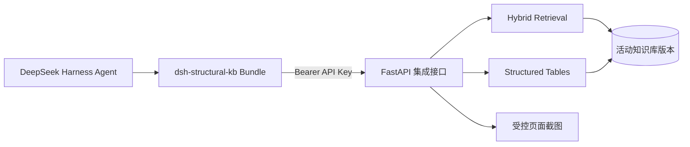

# DeepSeek Harness 插件集成设计

> 状态：生效
> 维护角色：工程负责人
> 文档更新：2026-08-22
> 完整运行验证：已完成 Harness 源码构建、Bundle 安装、Web 启动、插件清单核对和真实检索调用
> 验证证据：`integrations/deepseek-harness/dsh-structural-kb/`、`src/app/api/integrations.py`、`tests/test_harness_integration.py`、插件 `node --test`
> 复核周期：每次 Harness 主版本升级、集成 API 变更或知识库鉴权策略变更
> 代码/流程核对：2026-08-22，当前实现与运行验证一致

## 目标与边界

本集成让 DeepSeek Harness 的 Agent 可以调用本项目的规范检索能力。Harness 只承担 Agent 编排和工具调用，本项目继续负责 PDF 解析、知识库构建、规范化检索、结构化表格命中和页面证据访问。

插件是只读适配层，不把本项目的管理后台、重建、AI 校对、批准、发布、版本清理或删除能力暴露给 Harness。这样可以把 Agent 的权限限制在“查询已发布知识资产”，避免自然语言请求直接触发高风险管理操作。

## 运行架构

插件包位于 `integrations/deepseek-harness/dsh-structural-kb/`，不包含 PDF、向量库或真实密钥。Bundle 的 `cordis.patch.yml` 向 Harness 配置树插入一个 `structural-kb` 插件行，插件启动时向 `ctx.tools` 注册三个工具。

## 工具契约

| 工具 | 用途 | 副作用 | 关键返回信息 |
| --- | --- | --- | --- |
| `structural_kb_ready` | 检查知识库是否可以查询 | 无 | 就绪状态、数据版本哈希 |
| `search_structural_specs` | 检索正文、正文表格、条文和结构化表格 | 无 | 规范编号、权威等级、条文/表号、页码、摘录、命中原因 |
| `get_structural_spec_page` | 获取检索结果对应的 PDF 页面证据地址 | 无 | 来源文件、页码、受控 URL |

检索工具支持 `auto`、`table`、`clause`、`definition`、`general` 五种意图。对于“标准值、系数、限值、取多少、哪个表”等问题，调用方应优先使用 `table` 或 `auto`，并在回答中引用返回的规范编号、条文/表号和页码。检索分数仅用于排序，不能作为规范结论。

## 数据与权限边界

1. 后端接口受项目全局 API Key 鉴权保护；插件通过 `STRUCTURAL_KB_API_KEY` 读取 Key，不把 Key 写入 Bundle、Profile 或日志。
2. `document` 只作为服务端文档筛选条件，不能提交文件路径或任意 SQL/检索表达式。
3. 页面证据地址遵循项目来源访问策略。来源被禁止展示时，工具返回错误，不绕过 `asset_access_scope`。
4. 返回结果只引用活动知识版本的 `data_version_hash`，不允许插件自行选择数据库目录或绕过活动版本指针。
5. 服务端返回 401、403、422、503 或其他非 2xx 时，插件抛出工具错误，让 Harness 把基础设施问题与“未检索到答案”区分开。

## 失败与降级

- API 进程不可达：工具调用失败，Agent 不应编造规范结论。
- 知识库未就绪：接口返回 HTTP 503 和 `KNOWLEDGE_BASE_NOT_READY`。
- 鉴权失败：接口返回 HTTP 401；应检查 `STRUCTURAL_KB_API_KEY` 是否属于 API 服务的 `API_KEYS`。
- 无检索结果：接口仍返回成功响应，但 `result_count=0` 并带有 `warnings`；Agent 应明确说明未找到依据。
- 页面资产不可访问：不影响文本检索；只有在需要原始图表或公式核对时才调用页面工具。

## 当前已验证范围

- Harness `b150a55` 源码构建成功。
- 本地 Bundle 可由 `dsh plugin` 安装到隔离 Profile。
- Web 运行时插件清单显示 `structural-kb` 为“已挂载、已启用”。
- 插件直接调用真实 API 的 `ready` 和 `search` 工具成功；“办公楼楼面活荷载标准值”返回结构化表格结果，命中表 `5.1.1`。
- Python 集成契约测试覆盖成功响应、未知字段拒绝、鉴权保护和未就绪 503；插件自身有 Node 契约测试。

当前未验证范围：Harness 需要真实模型凭据才能完成“自然语言问题 -> Agent 自动选择工具 -> 生成最终回答”的模型回路；这不影响插件注册、工具执行和后端检索集成验证。
