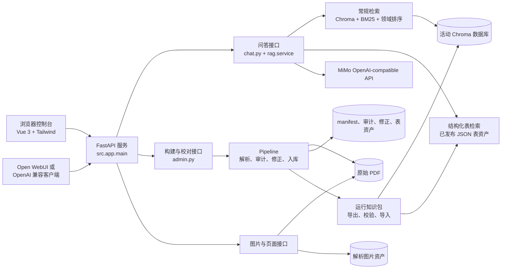
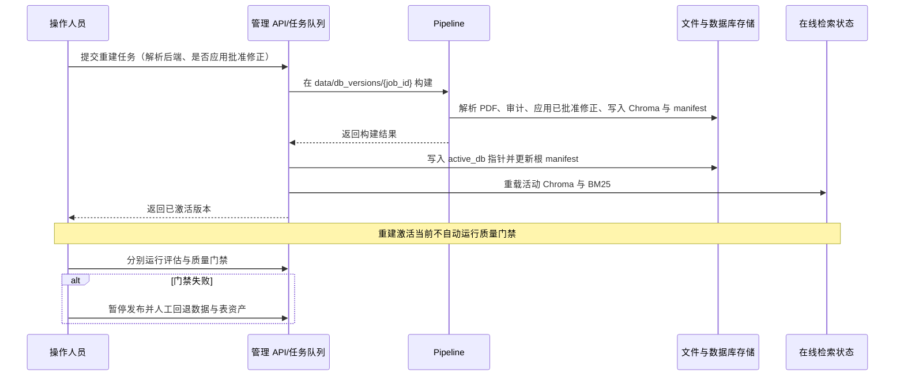
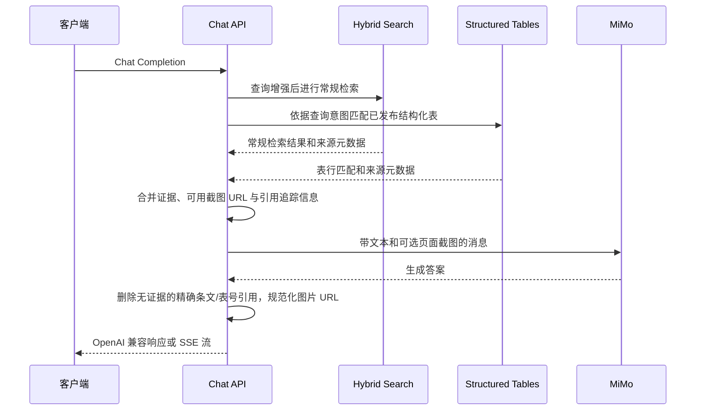
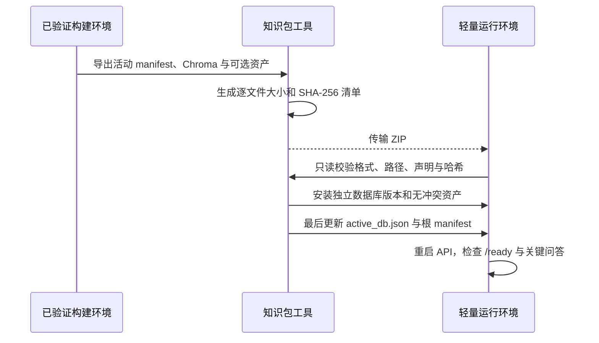

# 系统详细设计

> 状态：生效  
> 维护角色：工程负责人  
> 文档更新：2026-08-08  
> 代码核对：2026-08-08  
> 完整运行验证：2026-07-05（仅包含当时的后端测试、前端构建和质量评估；Docker 空环境与公网部署未验证）  
> 验证证据：`data/audit/reports/verification_latest.json`  
> 复核周期：接口、数据存储、部署或安全边界变化时；至少每次发布  
> 事实来源：`src/app/`、`src/pipeline/`、`src/evaluation/`、`src/quality/`、`frontend/`、`Dockerfile`、`docker-compose.yml`

## 1. 目的与范围

本文描述当前仓库已经实现的运行结构，供开发、排障、交接和发布核对使用。它与 [系统架构概览](系统架构概览.md) 配套：概览回答“系统由什么组成”，本文回答“组件如何协作、数据放在哪里、故障在哪里发生”。

本文不将以下能力表述为已完成：经 CI 和空环境实跑验证的生产级 Docker 交付、自动发布阻断、原始 PDF 或页面截图的受控访问、租户隔离、账号体系、版权授权台账。

## 2. 逻辑组件

| 组件 | 主要代码 | 职责 | 关键依赖 |
| --- | --- | --- | --- |
| Web 控制台 | `frontend/` | 构建、校对、评估和状态展示 | `/admin/*`、`/corrections/*`、`/page-images/*` |
| OpenAI 兼容层 | `src/app/api/chat.py` | 提供模型列表与 Chat Completions 接口 | API Key、RAG 服务、MiMo |
| RAG 编排 | `src/app/rag/` | 查询增强、证据合并、截图引用、答案引用规范化 | 检索、结构化表、MiMo |
| 常规检索 | `src/app/retrieval/` | 向量、BM25、条文、权威与表格意图排序 | 智谱 Embedding、Chroma、BM25 |
| 结构化表检索 | `src/app/rag/structured_tables.py` | 在人工发布表中匹配表、行、别名和查询意图 | `data/structured_tables/*.json` |
| 管理工作流 | `src/app/admin/` | 异步任务、重建、审计、校对、评估、表发布 | 本地文件系统、Pipeline、任务存储 |
| Pipeline | `src/pipeline/` | PDF 解析、审计、人工修正应用、chunk、入库、manifest | MinerU 或显式选择 PyMuPDF、智谱 Embedding |
| 知识包 | `src/pipeline/knowledge_package.py` | 将活动索引与可选运行资产导出、校验并安装到轻量环境 | ZIP、SHA-256、活动数据库指针 |
| 质量评估 | `src/evaluation/`、`src/quality/` | 检索、结构化表、回答级评估和质量门禁计算 | 评估集、活动数据版本、问答接口 |

## 3. 接口与访问边界

### 3.1 路由类别

| 路由类别 | 典型路径 | 当前用途 | `API_AUTH_ENABLED=true` 时的状态 |
| --- | --- | --- | --- |
| 健康与模型发现 | `/health`、`/ready`、`/metrics`、`/models` | 存活、就绪和客户端模型发现 | 公开 |
| 问答 | `/v1/chat/completions`、`/chat/completions` | RAG 问答与流式响应 | 受 API Key 保护 |
| 管理 | `/admin/*` | 重建、评估、队列、日志、表发布和回退 | 受 API Key 保护 |
| 修正 | `/corrections/*` | 候选状态、批准修正与提升 | 受 API Key 保护 |
| 静态与图片 | `/static/*`、`/images/*`、`/page-images/{doc}/{page}` | 控制台和回答引用的媒体 | 当前公开 |
| 知识状态 | `/knowledge/documents`、`/evaluation/status` | 控制台读取 manifest 摘要与评估集摘要 | 当前公开 |

鉴权逻辑仅按路径分类，不包含账号、角色、资源级授权或审计主体。反向代理场景会取消“本机请求”限流豁免，因此应在代理层正确传递来源 IP，并自行实施边界防护。

### 3.2 图片接口的特殊约束

`/images/*` 读取 `IMG_DIR` 中的解析图片；`/page-images/{doc}/{page}` 则定位 `data/raw` 中的原始 PDF，在请求时渲染目标页。因此：

1. 原始 PDF 是动态页面渲染的依赖，不是纯文本问答的依赖。服务只会在原 PDF 实际存在时向模型提供 `/page-images/*` 引用。
2. 匹配的解析图片可以通过 `/images/*` 独立提供；两类图片都不存在时，问答降级为纯文本证据，不编造图片 URL。
3. 这两个接口当前没有 API Key 鉴权或“回答证据与请求资源”关联校验。
4. 对外部署前，只能暴露确认允许公开的图片和 PDF；否则应先增加受控资源鉴权与版权策略。

## 4. 数据架构与生命周期

| 资产 | 默认位置 | 产生者 | 消费者 | 版本与恢复要求 |
| --- | --- | --- | --- | --- |
| 原始规范 PDF | `data/raw/` | 人工受控导入 | 解析、页面截图 | 与来源权利信息一起保留；页面引用恢复时必需 |
| 元数据 | `data/metadata/` | 人工维护/构建读取 | Pipeline、检索元数据 | 与 PDF 名称、版本一致 |
| 解析产物 | `data/processed/`、`data/mineru/` | Pipeline | 审计、人工校对、复杂表队列 | 可由 PDF 重建，保留用于问题追溯 |
| 修正候选与批准项 | `data/corrections/` | 审计、人工校对 | 下次重建 | 批准项是重建输入，必须备份 |
| 结构化表 | `data/structured_tables/` | 人工审核后发布 | 结构化表检索 | 发布版本和回退快照必须保留 |
| 构建 manifest | `data/manifest.json` | 重建工作流 | 状态、质量门禁、排障 | 与活动数据库版本一致 |
| 活动数据库指针 | `data/active_db.json` | 重建工作流 | 运行时检索初始化 | 指向可恢复的数据库版本 |
| 数据库版本 | `data/db_versions/{job_id}/db/` | 重建工作流 | Chroma 与 BM25 初始化 | 新版本先构建，随后切换指针 |
| 图片资产 | `data/images/` | 解析器 | 图片接口、模型输入 | 与数据版本及原始 PDF 一并备份 |
| 审计、评估和任务 | `data/audit/`、`data/jobs/` | 管理工作流 | 质量门禁、运维 | 用于发布证据和故障追溯 |
| 运行知识包 | 外部受控目录中的 `.zip` | `package-export` | `package-validate`、`package-import` | 包清单逐文件记录大小和 SHA-256；不得代替来源授权记录 |

`DB_DIR` 是基础 Chroma 路径配置；当前在线检索优先依据 `data/active_db.json` 定位活动版本。活动指针新写入的数据库和 manifest 路径相对于项目根目录保存，读取端兼容历史 Windows 绝对路径，并在原路径失效时按 `data/...` 后缀映射到当前项目。部署时不得只迁移 `DB_DIR` 而忽略活动指针、版本 manifest 和关联数据资产。

### 4.1 构建环境与运行环境

构建环境持有原始 PDF、MinerU、校对记录、结构化工作区、Embedding 凭据和完整质量证据。运行环境只需 API/前端依赖、问答与 Embedding 凭据，以及导入后的 manifest、预构建 Chroma、可选结构化表和图片。知识包不包含密钥、日志、候选修正和人工草稿。

运行包默认排除原始 PDF。只有来源登记明确允许分发且目标能力确实需要动态页面渲染时，才可使用 `--include-source-pdfs`。格式契约见 [知识包格式规范](../reference/知识包格式规范.md)。

## 5. 关键时序

### 5.1 重建与激活

重建会删除并生成部分解析、审计、图片和数据库产物；操作前必须保留可恢复版本。批准修正默认会在重建时应用，候选或待审项不会自动进入批准集。

### 5.2 问答与证据生成

常规检索和结构化表检索是并行证据来源，不以“结构化表重排普通结果”的方式实现。模型回答受提示词和后处理约束，但并非确定性规则引擎；发布质量必须依赖评估集与人工抽查。

### 5.3 复杂表发布

1. 扫描解析产物，生成复杂表人工结构化队列。
2. 操作人员创建或修改草稿；AI 只能生成建议，不直接发布。
3. 校验草稿字段、列、行和来源信息。
4. 发布时写入结构化表资产及版本快照，并清除缓存。
5. 执行结构化检索冒烟测试；失败时自动恢复上一版本，首次发布则撤下该文件。

完整检索与回答级评估不由此发布动作自动触发，仍须按发布流程执行。

### 5.4 运行知识包交付

导入默认拒绝已安装版本和内容不同的同名资产；`--replace` 只能在已备份并确认覆盖范围后使用。`--no-activate` 可用于预安装和验证，不改变当前活动指针。

## 6. 部署拓扑与当前限制

### 6.1 已支持的宿主机方式

宿主机启动前需安装 Python 3.11、运行时依赖、前端构建依赖，并构建 `frontend/dist`。FastAPI 将该目录挂载到 `/static`，根路径重定向至 `/static/index.html`。详见 [部署运行手册](../operations/部署运行手册.md)。

### 6.2 Docker Compose 的当前边界

`Dockerfile` 使用三个阶段：Node 22 构建 Vue 控制台、Python 3.11 安装运行依赖、最终 Python 3.11 运行镜像。最终镜像包含 `src/`、`frontend/dist`、评估集和规范元数据，不包含 Node.js、MinerU、原始 PDF 或已构建知识库。

Compose 将 `./data`、`./db` 和 `./logs` 持久化到宿主机，并用命名卷保存 Open WebUI 状态。API 镜像负责提供控制台，Open WebUI 是可选的问答客户端，通过 `/v1` 基址访问 API。运行知识包仍需在宿主机目录导入后由 `./data` 与 `./db` 挂载给容器。

当前实现尚需以下证据才能提升为已验证交付：

1. GitHub Actions 完成镜像构建、`/health` 和 `/static/index.html` 冒烟测试。
2. 在空环境完成知识包导入、重启、问答、页面图片、备份和回退验证。
3. 验证 `API_AUTH_ENABLED=true` 时项目控制台与 Open WebUI 的 Key 配置。
4. 对外部署前通过反向代理提供 TLS，并解决受限图片和 PDF 页面的资源级访问控制。

## 7. 安全、版权与运营控制

| 领域 | 当前实现 | 已知限制 | 发布前要求 |
| --- | --- | --- | --- |
| API 鉴权 | 可配置 API Key | 不是用户身份或角色模型 | 开启 `API_AUTH_ENABLED`，设置强随机密钥 |
| 限流 | 进程内按 IP 和路径计数 | 非分布式，代理信任边界需额外处理 | 结合反向代理/WAF 设计 |
| 图片与 PDF | 图片和按页渲染接口公开 | 无资源级授权，可能暴露受限扫描件 | 未完成鉴权前不得公开受限内容 |
| 来源权利 | 文档政策与登记模板已建立 | 尚无真实来源台账和法律复核 | 每份对外内容完成来源、权限和展示范围核对 |
| 密钥 | `.env` 配置、Git 忽略 | 无专用密钥管理服务或轮换机制 | 使用部署环境的机密管理与轮换记录 |
| 审计 | 任务、评估和数据版本文件化保存 | 无集中日志或不可篡改审计 | 保留发布记录、回退点和事故记录 |

## 8. 观测、质量与恢复

### 8.1 最小观测面

- `/health`：进程存活。
- `/ready`：检索依赖和知识库可用性。
- `/metrics`：请求、错误和检索相关指标。
- `/admin/jobs/{job_id}/logs`：构建、审计和评估任务日志。
- `/admin/quality/status`：数据版本、评估摘要、未解决失败任务和质量门禁结果。

### 8.2 质量证据

当前质量体系包含常规检索评估、结构化表专项评估、回答级盲测和质量门禁计算。最近完整证据见 `data/audit/reports/verification_latest.json`，生成时间为 2026-07-05；其结论不能替代本次或未来发布的重新验证。

### 8.3 回退顺序

1. 暂停受影响的公网入口或切换到已知稳定版本。
2. 恢复 `active_db.json` 指向的数据库版本与对应 manifest。
3. 恢复相关结构化表发布版本、批准修正、图片资产和原始 PDF。
4. 重启或重载检索状态，验证 `/ready`、关键问答与页面截图。
5. 记录影响范围、数据版本、恢复动作和后续 ADR/事故记录。

## 9. 变更控制与待补齐项

以下变更必须更新本文，并按需要创建 ADR 或发布记录：

- 模型供应商、Embedding、Reranker 或检索排序策略变更。
- PDF 解析器、数据模式、表资产模式或修正应用规则变更。
- API 路由、鉴权、图片访问、部署拓扑或持久卷策略变更。
- 内容来源、版权展示范围或对外服务形态变更。

当前优先技术缺口：

1. 将已用于知识包导出的质量门禁进一步接入活动数据库激活链路。
2. 为图片、原始 PDF 和静态资源增加受控访问策略。
3. 基于运行知识包完成完整 Docker/桌面运行环境、空环境安装和跨主版本兼容验证。
4. 为服务端引入用户、角色、租户和审计主体模型前，保持服务范围为受控小规模试用。
