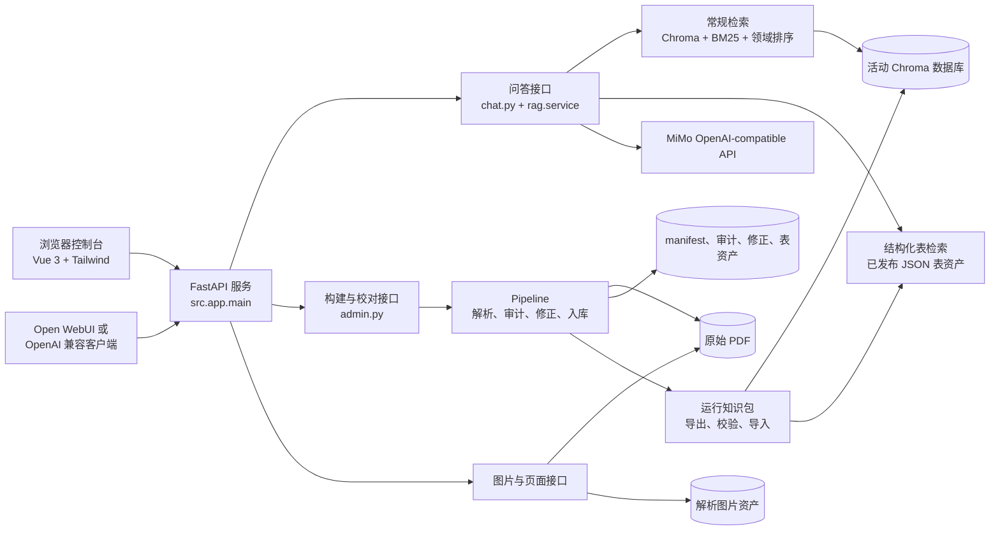
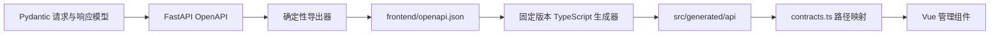
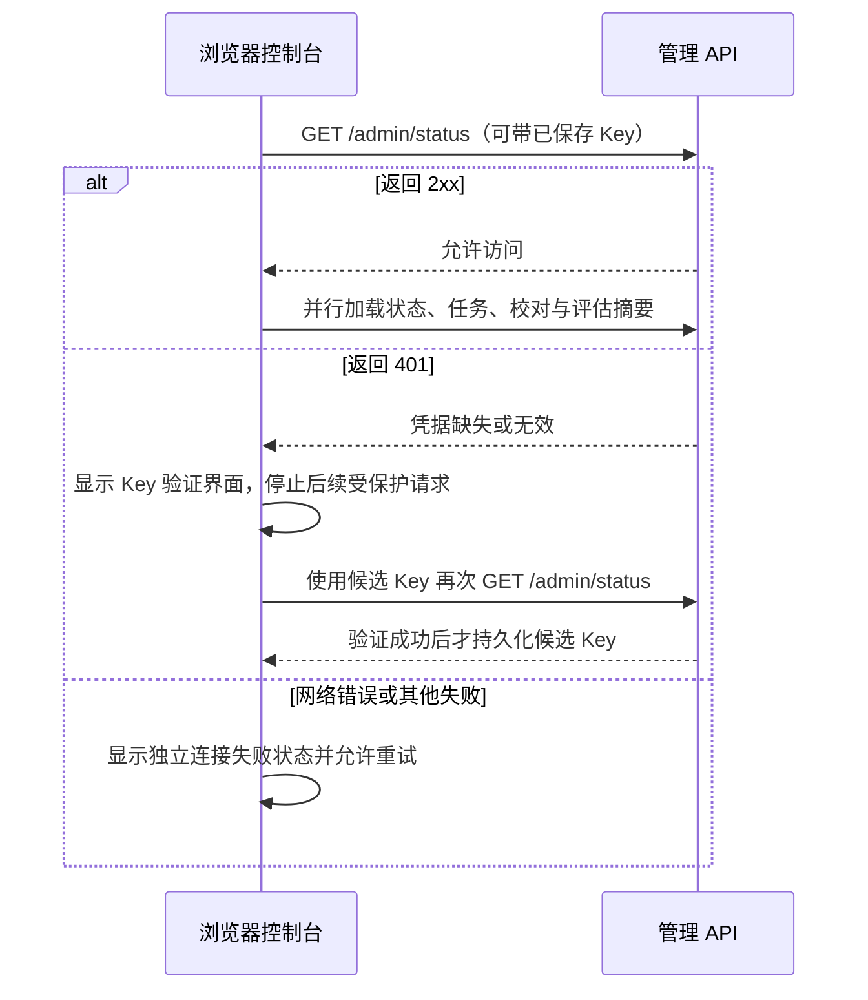
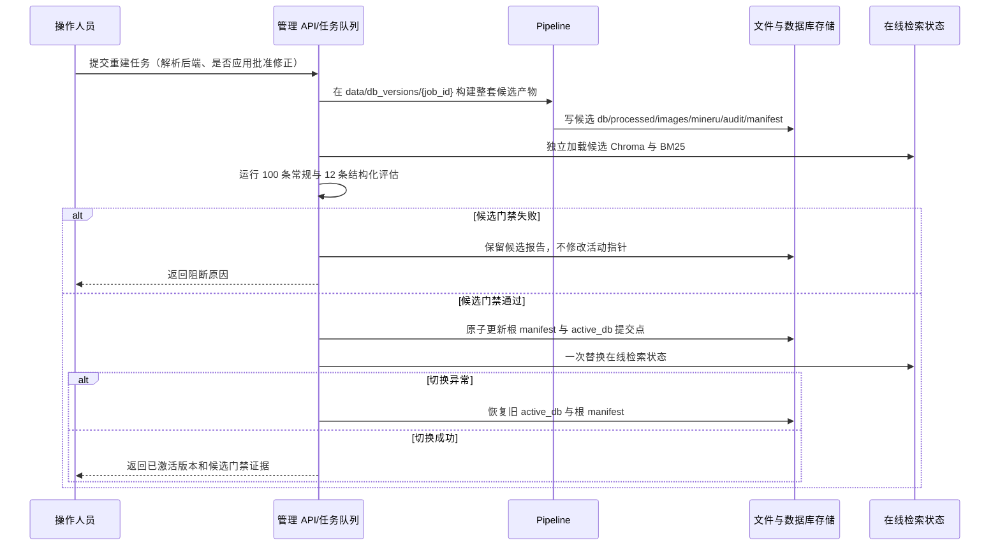
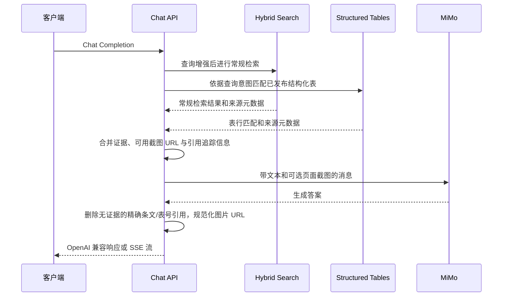
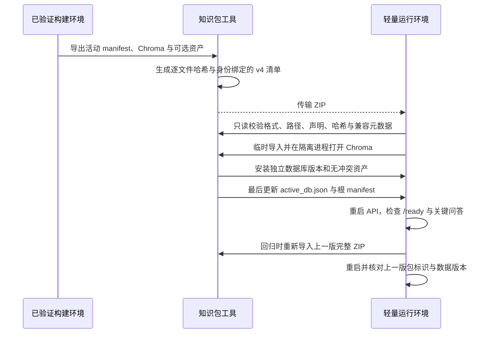
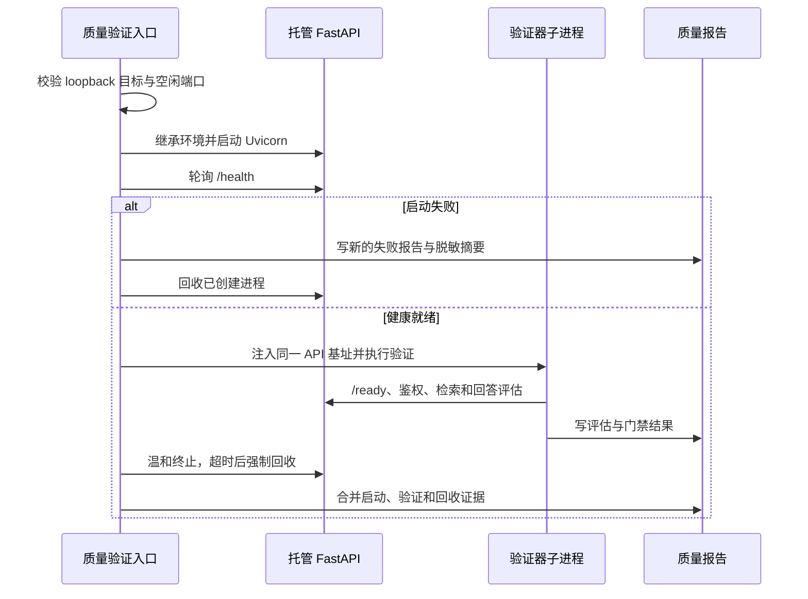
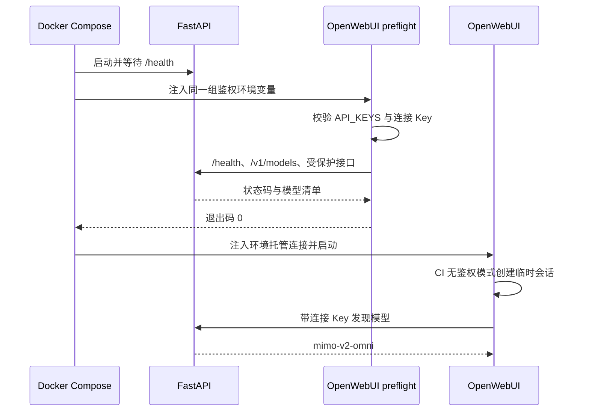

# 系统详细设计

> 状态：生效  
> 维护角色：工程负责人  
> 文档更新：2026-08-12
> 代码核对：2026-08-12（I-038 管理 API 契约生成链）
> 完整运行验证：2026-08-12（I-038 本地 533 项后端测试与完整前端/工程门禁通过；远程 CI 待完成，真实发布质量与公网部署尚未验证）
> 验证证据：[质量证据原子发布验证记录](../releases/质量证据原子发布验证记录.md)、[质量证据运行身份与配置指纹验证记录](../releases/质量证据运行身份与配置指纹验证记录.md)、[环境自检验证记录](../releases/环境自检验证记录.md)、[配置示例可执行验证记录](../releases/配置示例可执行验证记录.md)
> 复核周期：接口、数据存储、部署或安全边界变化时；至少每次发布  
> 事实来源：`src/app/`、`src/pipeline/`、`src/evaluation/`、`src/quality/`、`frontend/`、`Dockerfile`、`docker-compose.yml`

## 1. 目的与范围

本文描述当前仓库已经实现的运行结构，供开发、排障、交接和发布核对使用。它与 [系统架构概览](系统架构概览.md) 配套：概览回答“系统由什么组成”，本文回答“组件如何协作、数据放在哪里、故障在哪里发生”。

本文不将以下能力表述为已完成：完整 Compose/Open WebUI 生产拓扑联调、回答级盲测的候选 API 隔离执行、集中式可观测平台、租户隔离、账号体系、真实版权授权台账和公网生产服务验证。候选检索预激活门禁、API 容器冒烟、知识包导出质量门禁以及原始 PDF/图片来源分级访问已有自动化证据；远程结论以对应验证记录为准。

## 2. 逻辑组件

| 组件 | 主要代码 | 职责 | 关键依赖 |
| --- | --- | --- | --- |
| Web 控制台 | `frontend/` | 构建、校对、评估和状态展示 | `/admin/*`、`/corrections/*`、`/page-images/*` |
| OpenAI 兼容层 | `src/app/api/chat.py` | 提供模型列表与 Chat Completions 接口 | API Key、RAG 服务、MiMo |
| RAG 编排 | `src/app/rag/` | 查询增强、证据合并、截图引用、答案引用规范化 | 检索、结构化表、MiMo |
| 常规检索 | `src/app/retrieval/` | 向量、BM25、条文、权威与表格意图基线排序，按配置扩展精排候选池 | 智谱 Embedding、Chroma、BM25 |
| 可选学习型精排 | `src/app/rerank/` | 智谱 HTTP 重排序、响应校验、基线/模型秩融合与失败开放 | 智谱 Rerank API；默认关闭 |
| 结构化表检索 | `src/app/rag/structured_tables.py` | 在人工发布表中匹配表、行、别名和查询意图 | `data/structured_tables/*.json` |
| 管理工作流 | `src/app/admin/` | 异步任务、重建、审计、校对、评估、表发布 | 本地文件系统、Pipeline、任务存储 |
| Pipeline | `src/pipeline/` | PDF 解析、审计、人工修正应用、chunk、入库、manifest | MinerU 或显式选择 PyMuPDF、智谱 Embedding |
| 知识包 | `src/pipeline/knowledge_package.py` | 将活动索引与可选运行资产导出、校验并安装到轻量环境 | ZIP、SHA-256、活动数据库指针 |
| 质量评估 | `src/evaluation/`、`src/quality/` | 检索、结构化表、回答级评估和质量门禁计算 | 评估集、活动数据版本、问答接口 |
| 接口契约生成 | `src/app/schemas/admin.py`、`scripts/export_openapi.py`、`frontend/src/generated/api/` | 固定管理响应、导出确定性 OpenAPI、生成前端类型并阻止漂移 | FastAPI、Pydantic、`@hey-api/openapi-ts` |

## 3. 接口与访问边界

### 3.1 路由类别

| 路由类别 | 典型路径 | 当前用途 | `API_AUTH_ENABLED=true` 时的状态 |
| --- | --- | --- | --- |
| 健康与模型发现 | `/health`、`/ready`、`/metrics`、`/models` | 存活、就绪和客户端模型发现 | 公开 |
| 问答 | `/v1/chat/completions`、`/chat/completions` | RAG 问答与流式响应 | 受 API Key 保护 |
| 管理 | `/admin/*` | 重建、评估、队列、日志、表发布和回退 | 受 API Key 保护 |
| 修正 | `/corrections/*` | 候选状态、批准修正与提升 | 受 API Key 保护 |
| 静态与图片 | `/static/*`、`/images/*`、`/page-images/{doc}/{page}` | 控制台和回答引用的媒体 | 静态页公开；图片按来源策略公开、鉴权或禁用 |
| 知识状态 | `/knowledge/documents`、`/evaluation/status` | 控制台读取 manifest 摘要与评估集摘要 | 当前公开 |

聊天和管理鉴权仍按路径分类，不包含账号、角色或租户模型。图片在此基础上增加来源级展示范围。反向代理场景会取消“本机请求”限流和受保护图片的本机豁免，因此应在代理层正确传递来源 IP，并自行实施边界防护。

### 3.2 管理 API 契约生成链

FastAPI 路由与 Pydantic 模型是接口语义的唯一权威来源。43 个 JSON 管理操作的 HTTP 200 响应引用具名模型；页面截图操作声明 `image/png`。响应默认拒绝未建模顶层字段，只有 manifest、原始候选/人工队列/草稿、AI 建议、批准修正文件和单元素七类登记载荷允许扩展。导出器在不启动服务器、不读取模型凭据和不修改运行数据的条件下生成排序稳定的 UTF-8 快照，并拒绝空 schema、重复 operation id 和错误媒体类型。

前端只从快照生成声明。`api.ts` 的管理帮助函数按路径映射请求体与响应，不提供默认 `any`；`contracts.ts` 只负责操作路径和控制台视图边界，不复制后端数据模型。CI 在 Windows/Linux 后端任务中验证快照，在前端任务中重生成类型并拒绝差异。具体维护流程见[契约规范](../reference/管理API与前端类型契约规范.md)。

### 3.3 控制台访问探测

控制台不读取服务端配置，也不以 `localStorage` 中是否存在 Key 推断鉴权开关。首次加载和手工刷新使用 `/admin/status` 进行单次访问探测：

运行中任一 API 请求返回 401 时，API 客户端通过统一浏览器事件回到验证状态。事件携带 HTTP 状态和安全的错误信息，不携带 Key。该流程不创建服务端会话，也不改变 `ServiceMiddleware` 对每次请求独立校验 API Key 的安全模型。

### 3.4 图片接口的特殊约束

`/images/*` 读取 `IMG_DIR` 中的解析图片；`/page-images/{doc}/{page}` 则定位 `data/raw` 中的原始 PDF，在请求时渲染目标页。因此：

1. 原始 PDF 是动态页面渲染的依赖，不是纯文本问答的依赖。服务只会在原 PDF 实际存在时向模型提供 `/page-images/*` 引用。
2. 匹配的解析图片可以通过 `/images/*` 独立提供；两类图片都不存在时，问答降级为纯文本证据，不编造图片 URL。
3. `data/metadata/specs.json` 分别用 `image_access` 和 `page_image_access` 声明 `public`、`authenticated` 或 `disabled`。未知来源默认受保护，无效策略失败关闭。
4. API 鉴权开启后，受保护资源接受 API Key 或与路径和过期时间绑定的短期 HMAC 签名；RAG 自动生成签名引用，不把长期 Key 写入 URL。
5. API 鉴权关闭时，受保护资源只允许直接回环请求；经代理、隧道或远程地址访问会被拒绝。`/images/*` 还会验证最终路径位于 `IMG_DIR` 内。
6. 来源策略控制技术访问，不替代内容授权结论；对外部署仍只允许展示已核对权利范围的资料。

## 4. 数据架构与生命周期

| 资产 | 默认位置 | 产生者 | 消费者 | 版本与恢复要求 |
| --- | --- | --- | --- | --- |
| 原始规范 PDF | `data/raw/` | 人工受控导入 | 解析、页面截图 | 与来源权利信息一起保留；页面引用恢复时必需 |
| 元数据 | `data/metadata/` | 人工维护/构建读取 | Pipeline、检索元数据 | 与 PDF 名称、版本一致 |
| 候选/活动解析产物 | `data/db_versions/{job_id}/processed/`、`mineru/` | Pipeline | 审计、人工校对、复杂表队列 | 与数据库同版本；历史指针缺字段时兼容回退到 `data/processed/`、`data/mineru/` |
| 修正候选与批准项 | `data/corrections/` | 审计、人工校对 | 下次重建 | 批准项是重建输入，必须备份 |
| 结构化表 | `data/structured_tables/` | 人工审核后发布 | 结构化表检索 | 发布版本和回退快照必须保留 |
| 根 manifest 兼容副本 | `data/manifest.json` | 重建工作流 | 历史状态工具、排障 | 激活事务中随活动版本更新，不是提交点 |
| 活动运行资产指针 | `data/active_db.json` | 重建工作流 | 检索、解析文本和图片解析 | 指向已通过候选门禁的整套运行版本，是提交点 |
| 候选/活动版本 | `data/db_versions/{job_id}/` | 重建工作流 | Chroma、BM25、校对、图片和审计 | 包含 `db`、`processed`、`images`、`mineru`、`audit`、`quality` 和 manifest |
| 图片资产 | `data/db_versions/{job_id}/images/` | 解析器 | 图片接口、模型输入 | 与数据库版本一起切换；知识包导入兼容使用 `data/images/` |
| 审计、评估和任务 | `data/audit/`、`data/jobs/` | 管理工作流 | 质量门禁、运维 | 用于发布证据和故障追溯 |
| 运行知识包 | 外部受控目录中的 `.zip` | `package-export` | `package-validate`、`package-probe`、`package-import` | v4 清单绑定 payload、质量、能力与兼容身份；不得代替来源授权记录 |

表中 `data/` 均表示可由 `DATA_DIR` 配置的统一运行数据根，未设置时才是项目内目录。当前在线检索、管理端解析文本和图片接口优先依据 `$DATA_DIR/active_db.json` 定位活动版本；活动指针中的数据库、解析文本、图片、MinerU、审计和 manifest 使用可移植相对路径，读取端兼容历史 Windows/Posix 绝对路径及缺少扩展目录字段的旧指针。`IMG_DIR` 和 `SOURCE_METADATA_PATH` 只在显式设置时覆盖数据根默认位置；`DB_DIR` 仅是无活动指针时的基础 Chroma 回退。部署时不得只迁移 `DB_DIR` 而忽略整个 `DATA_DIR`。详细决策见 [ADR 0008](../adr/0008-运行数据根采用显式单一配置.md)。

### 4.1 构建环境与运行环境

构建环境持有原始 PDF、受控解析器、校对记录、结构化工作区、Embedding 凭据和完整质量证据。当前知识生产依赖由 `requirements-parser.txt` 独立锁定，项目后端 `mineru` 的生产兼容矩阵只有 `magic-pdf 1.3.12`。`parser-status` 和重建预检会校验 CLI 路径、实现与版本；严格策略在任何候选清理前失败关闭。显式试验策略仍把未验证状态写入 manifest 和 `artifacts.json`，不能作为生产支持证据。详细决策见 [ADR 0010](../adr/0010-PDF解析器采用显式兼容契约.md)。

运行环境只需 API/前端依赖、问答与 Embedding 凭据，以及导入后的 manifest、预构建 Chroma、可选结构化表和图片。知识包不包含解析器、密钥、日志、候选修正和人工草稿。

运行包默认排除原始 PDF。只有来源登记明确允许分发且目标能力确实需要动态页面渲染时，才可使用 `--include-source-pdfs`。格式契约见 [知识包格式规范](../reference/知识包格式规范.md)。

## 5. 关键时序

### 5.1 重建与激活

重建只清理本次候选版本目录，不在构建阶段删除活动解析文本、图片或数据库。批准修正默认会在候选构建时应用，候选或待审项不会自动进入批准集。候选门禁不调用在线问答 API 或外部 LLM；激活后仍须运行回答级盲测并通过完整发布质量门禁。

### 5.2 问答与证据生成

常规检索和结构化表检索是并行证据来源，不以“结构化表重排普通结果”的方式实现。常规检索内部可选学习型精排：先保留最多 128 条扩展候选，再以默认 0.35 的模型权重融合基线与模型位次，最终截断为 `RAG_TOP_K`；供应商异常只增加降级指标，不使问答失败。该能力默认关闭，工程可用不等于质量收益，启用必须绑定同数据版本对照报告。模型回答受提示词和后处理约束，但并非确定性规则引擎；发布质量必须依赖评估集与人工抽查。

### 5.3 复杂表发布

1. 扫描解析产物，生成复杂表人工结构化队列。
2. 操作人员创建或修改草稿；AI 只能生成建议，不直接发布。
3. 校验草稿字段、列、行和来源信息。
4. 发布时写入结构化表资产及版本快照，并清除缓存。
5. 执行结构化检索冒烟测试；失败时自动恢复上一版本，首次发布则撤下该文件。

完整检索与回答级评估不由此发布动作自动触发，仍须按发布流程执行。

### 5.4 运行知识包交付

`package-probe` 在临时目录执行真实导入，并用独立 Python 子进程打开 Chroma、核对集合数量和读取样本。子进程用于隔离 Chroma 原生索引状态与 Windows 文件锁，探测完成后不会改变项目活动指针。正式导入默认拒绝已安装版本和内容不同的同名资产；`--replace` 只能在维护窗口、上一版完整包已保留且覆盖范围已确认时使用。`--no-activate` 只预装独立数据库版本，不改变当前活动指针、根 manifest 或共享资产。

运行包升级和回退使用同一条事务导入路径。单次导入中，既有版本目录、冲突资产、根 manifest 与活动指针先移动到临时备份；任何后续步骤失败时删除本次创建目标并按逆序恢复。命令成功后临时备份删除，因此发布级回退必须重新导入保留的上一版完整知识包，并重启 API 核对包标识、数据版本、计数与实际数据库路径。该方案需要维护窗口，不提供热重载、零停机或主机级灾难恢复。详见 [ADR 0009](../adr/0009-运行知识恢复采用受控知识包重部署.md)。

### 5.5 运行数据快照与灾难恢复

运行知识包只恢复问答运行资产；完整 `DATA_DIR` 另使用 `structural-spec-runtime-backup` schema v1。创建工具在维护窗口检查活动任务，拒绝符号链接和源内输出，以文件/目录完整声明生成内容寻址身份，并在写 ZIP 前后两次扫描源。离线校验覆盖路径、成员、解压总量、拓扑、哈希和身份，不修改当前运行数据。

恢复先在目标父目录解压并恢复元数据，复核完整 inventory 后才将既有目标原子移动到临时目录并安装新目录。安装失败自动恢复原目标；二次回退失败时保留旧数据临时目录。该协议不提供在线快照、增量复制、静态加密或外部存储调度，详见 [ADR 0013](../adr/0013-运行数据采用离线完整快照与事务恢复.md) 与[格式规范](../reference/运行数据快照格式规范.md)。

### 5.6 版本保留与清理

管理端按需扫描 `data/db_versions` 的普通直接子目录，不跟随符号链接或 Windows 重解析点。版本根据活动指针、运行任务、候选门禁、manifest 和 `.retention.json` 分为活动、运行中、门禁通过、门禁失败、旧版完整、不完整和异常状态。

清理是双阶段协议：`cleanup-plans` 使用数量、期限、最短保护期和高低水位生成限时计划，记录大小、文件数、最新修改时间以及 manifest/门禁摘要形成的指纹；`cleanup-versions` 在串行后台任务中重新计算保护集和指纹。策略、活动状态、运行状态、固定状态或内容发生变化时，对应项跳过或整份计划失效。删除目标先原子改名为版本根目录内的 `.deleting-*` 隔离名，再递归删除；失败时尽力恢复原名，并把部分失败写入报告且令任务失败。

计划、执行报告和事件分别保存在 `data/audit/version_retention/plans`、`executions` 和 `events.jsonl`。系统不存在客户端指定路径或临时阈值的删除入口。原始 PDF、全局审批和活动提交点不在清理范围内。

### 5.7 后台任务持久化与启动恢复

管理工作流由进程内 `ThreadPoolExecutor(max_workers=1)` 串行执行。每个任务在 `data/jobs/{job_id}.json` 保存状态、参数、输出、执行器实例、心跳、进度、稳定错误码和恢复元数据，在同名 `.jsonl` 保存追加日志。状态写入经过进程内互斥，在同目录写临时文件、刷新并 `fsync` 后原子替换；读取时同时校验任务标识格式以及文件名与 JSON 内 `job_id` 一致。单条损坏记录降级为 `JOB_RECORD_INVALID`，不阻断其他任务读取和 API 启动。

运行任务由独立低频线程更新 `heartbeat_at`；工作流每次推进步骤时更新 `progress_at`。终态保存前停止并等待心跳线程退出，避免较晚心跳覆盖成功或失败状态。API 列表与详情从这两个时间分别计算进度年龄和心跳年龄：进度超阈值产生 `stalled`，已有心跳超时产生 `heartbeat_stale`，两者都只提供诊断，不改变仍在执行的线程状态。

API 启动先生成新的 `worker_id` 并对账磁盘任务。属于旧执行器的 `queued`/`running` 任务无法证明可幂等续跑，因此统一转成 `failed`/`interrupted`，错误码为 `PROCESS_RESTARTED`，并记录原状态、原执行器、恢复执行器和时间。该操作幂等，不改写终态任务；候选产物保留给人工核对。当前所有权模型只允许单 API 进程和单工作线程，多 worker、多副本、自动续跑、断点恢复及强制取消均不在已实现边界内。详见 [ADR 0007](../adr/0007-后台任务采用租约诊断与启动中断恢复.md)。

### 5.8 一命令质量验证

`scripts/verify_quality.py --manage-api` 为本机发布验证建立独立的 API 生命周期，不改变连接既有 API 的兼容模式。托管目标必须是显式端口的 loopback HTTP 基址，端口占用时失败关闭。父进程只管理自己创建的 Uvicorn 进程，模型和鉴权配置从受控环境继承，任何原始秘密都不进入命令参数或机器可读报告。

API 进程健康不等于知识库就绪，也不等于内容质量通过。子验证器仍执行 `/ready`、管理接口鉴权、100 条常规检索、12 条结构化检索、24 条回答盲测和完整门禁。启动失败不会发送注定失败的评估请求；内容门禁失败则保留为真实质量失败。详细边界见 [ADR 0015](../adr/0015-无人值守质量验证采用受控本地API生命周期.md)。

完整验证为每次执行生成 32 位 `verification_run_id`，检索评估任务只携带该关联标识；实际 API 进程根据检索、精排、模型、图片证据配置以及受控关键源码计算 `runtime_config_hash` 并写入报告。三类报告必须具有相同运行 ID、证据契约版本和运行指纹，且指纹必须匹配当前门禁进程。单项控制台评估仍可用于诊断，但缺少完整运行身份时不能组成发布通过证据。该契约见 [ADR 0025](../adr/0025-发布质量证据采用同次运行身份与配置指纹.md)。

完整验证不会逐项覆盖权威最新状态。常规检索、结构化检索、回答盲测、质量门禁和总验证报告先写入 `data/audit/reports/runs/<verification_run_id>/`；显式跳过或前置失败也生成同运行的失败占位报告。全部十个 JSON/Markdown 产物可读且运行身份一致后生成带大小和 SHA-256 的 `manifest.json`，再复制兼容文件并最后原子替换 `quality_run_latest.json`。清单生成后运行目录不可修改；发布中断可在产物未变化时重试。托管模式由子进程准备运行目录，父进程完成 API 回收后才写最终验证报告并发布，避免“回收失败但指针显示通过”。详细契约见 [ADR 0026](../adr/0026-完整质量证据采用运行目录与原子指针发布.md)。

`--preflight-only` 在完整执行前复用同一 `/ready` 和管理端鉴权契约。连接既有 API 时只读探测目标；托管模式仍创建并回收独占 loopback 进程。该分支不进入测试、评估和质量门禁，也不写任何质量 `latest` 报告，只更新不作为质量证据的托管启动日志。结构化 JSON 的非零退出码表示运行前置条件不成立，不能解释为模型内容质量结论。详见 [ADR 0017](../adr/0017-质量验证采用无副作用前置条件预检.md)。

### 5.9 CI 外部执行依赖

仓库 workflow 中的外部 GitHub Action 与 Python/npm 依赖一样属于可执行供应链。每个 `uses:` 外部引用固定到完整提交 SHA，并在同行保留语义版本注释；本地 action 和 `docker://` action 不需要 Git 提交引用。`scripts/validate_ci_actions.py` 离线扫描全部 workflow，拒绝可变引用、缺失版本注释及低于项目核验 Node.js 24 代际的官方 action。

dependency-lock 任务在安装项目代码依赖前后执行该校验，后端测试也覆盖真实 workflow 和失败样例。Dependabot 每周按组提出固定 SHA 更新，但不自动合并；升级评审须核对官方标签、提交、`action.yml` 运行时及完整远程矩阵。具体边界见 [ADR 0018](../adr/0018-CI外部Action采用不可变引用与自动维护.md)。

### 5.10 部署环境只读自检

`python -m src.doctor` 在 API 启动前提供统一环境诊断。公共层从 `dependency-lock.json` 读取 Python 版本契约，从对应 `.in` 与精确锁推导直接依赖并核对已安装版本，同时通过独立子进程执行真实应用配置校验。子进程结果只保留经过敏感环境值替换的错误项，报告不枚举环境变量或密钥值。

`runtime` 配置检查回答所需的 ZhipuAI/MiMo 凭据、`frontend/dist/index.html`、活动 manifest、活动数据库和来源元数据。`build` 配置改用知识生产精确锁，只要求 Embedding 凭据，并检查 PDF 输入、既有可写生产目录及 MinerU 实现/版本；缺少 MiMo 只表示 AI 校对候选不可生成，记为非阻断警告。

每项结果使用稳定检查标识和 `passed`、`warning`、`failed` 状态。默认文本供人工阅读，`--format json` 提供 schema v1、汇总和退出码契约。检查过程不创建目录、不写报告、不打开 Chroma、不启动服务、不构建知识库或调用模型；因此通过结论只证明静态前置条件成立，运行态仍由 `/ready` 和知识包探针验证，内容发布仍由质量门禁决定。具体决策见 [ADR 0019](../adr/0019-部署环境采用分层只读自检.md)。

### 5.11 Python 静态质量门禁

`requirements-dev.in` 精确固定 Ruff，并由通用依赖锁生成带哈希的开发锁；运行和 PDF 解析环境不安装该工具。`pyproject.toml` 将目标版本固定为 Python 3.11，统一 100 字符行宽、LF 行尾、`src`/`scripts`/`tests` 三类检查目录及 `E4/E7/E9/F/I/B/UP` 规则。`.gitattributes` 使 Windows checkout 不会破坏格式器的 LF 契约。

Windows/Linux 后端 CI 在 pytest 前执行 `python -m ruff check src scripts tests` 与 `python -m ruff format --check src scripts tests`。静态检查要求并行序列调用显式选择 `zip(strict=...)`，但它不替代类型检查、业务测试、运行探针或内容质量验证。配置、依赖版本和 CI 命令由 `tests/test_python_quality_gate.py` 反向校验。具体决策见 [ADR 0020](../adr/0020-Python代码采用固定Ruff静态质量门禁.md)。

## 6. 部署拓扑与当前限制

### 6.1 已支持的宿主机方式

宿主机启动前需安装 Python 3.11、运行时依赖、前端构建依赖，并构建 `frontend/dist`。FastAPI 将该目录挂载到 `/static`，根路径重定向至 `/static/index.html`。详见 [部署运行手册](../operations/部署运行手册.md)。

`.env.example` 不是自由文本：`scripts/validate_configuration_example.py` 通过 `python-dotenv` 严格读取并拒绝重复键和非空秘密，再在隔离环境调用实际配置预检。Windows/Linux 后端 CI 显式运行该命令；容器任务用同一示例执行 `docker compose config`。该契约阻止示例语法、值范围和 Compose 变量关系静默漂移，但不生成或验证真实凭据。

### 6.2 Docker Compose 的当前边界

`Dockerfile` 使用三个阶段：Node 22 构建 Vue 控制台、Python 3.11 按哈希安装运行锁、最终 Python 3.11 运行镜像。运行、开发和知识生产的 Python 直接依赖分别由 `.in` 维护，`dependency-lock.json` 固定 `uv`、Python 和依赖时间截点，CI 从临时目录重新解析三份锁以阻止漂移。最终镜像包含 `src/`、`frontend/dist`、评估集和规范元数据，不包含 Node.js、PDF 解析器、原始 PDF 或已构建知识库。API 与 preflight 使用同一个显式命名的应用镜像；只有 API 服务声明构建上下文，避免同一源码被重复构建为两个不可追溯制品。

Compose 以 `DATA_DIR=/app/data` 将 `./data` 作为主持久卷，同时保留 `./db` 作为旧库回退并挂载 `./logs`；Open WebUI 状态使用命名卷。API 镜像负责提供控制台，Open WebUI 是可选的问答客户端，通过 `/v1` 基址访问 API。运行知识包在宿主机 `./data` 导入后即可由同一主数据卷启动容器。

外部 Compose 镜像通过 `scripts/pull_compose_images.py` 在启动前显式获取。该入口只对已分类的仓库瞬时故障执行有限指数退避，永久或未知错误保留原退出码；成功后 `docker compose up` 使用 `--pull never`，使“镜像获取”“容器创建”和“运行健康”成为可分别归因的阶段。CI 与部署手册复用同一跨平台入口，不在 YAML 或 shell 中复制重试循环。该机制不替代镜像 digest、漏洞扫描或健康探针，具体边界见 [ADR 0021](../adr/0021-外部容器镜像采用有限重试与分阶段启动.md)。

外部构建和运行输入进一步使用可读标签与 OCI image index digest 双重固定。`scripts/validate_container_images.py` 解析 Dockerfile，并调用 `docker compose config --format json` 检查渲染服务图；声明本地 `build` 的应用镜像及其跨服务复用是唯一豁免。主 CI 执行不访问 registry 的确定性校验，独立定时 workflow 执行远程摘要漂移检查，Dockerfile 与 Compose 由不同 Dependabot 生态监控。摘要固定不替代漏洞或签名验证，详见 [ADR 0022](../adr/0022-外部容器镜像采用标签与多架构摘要双重固定.md)。

最终运行镜像在 CI 完成构建和健康检查后由固定版本 Trivy 扫描。流水线先记录 scanner version，再生成 SPDX JSON SBOM 和不应用例外的完整漏洞 JSON，最后执行独立阻断命令：只对具有修复版本的 HIGH/CRITICAL OS 与语言包发现返回失败。`.trivyignore.yaml` 采用校验器限制的严格 JSON/YAML 子集，禁止全局或永久忽略；每项例外必须限制到路径或 PURL，并在 90 天内到期。普通提交只做确定性锁与 workflow 契约校验，独立每周任务查询扫描器最新不可变发行版及 Linux 资产摘要，避免把外部查询可用性引入每次提交。详见 [ADR 0023](../adr/0023-运行容器采用SBOM与时效化漏洞门禁.md)。

OpenWebUI 连接由环境声明的复数变量管理，并关闭 `PersistentConfig` 对声明值的覆盖。一次性 `openwebui-preflight` 在 API 健康后执行静态 Key 关系检查和真实 HTTP 鉴权探测；只有 preflight 成功退出，OpenWebUI 才启动。探针用 malformed chat 请求验证鉴权先于请求体校验，因此不会触发 MiMo 调用，也不会在输出中记录 Key。

`WEBUI_AUTH=false` 只取消交互式登录要求，不会让 OpenWebUI v0.9.5 的 `/api/models` 匿名开放。真实容器联调必须先通过 `/api/v1/auths/signin` 建立该临时实例的用户会话，再携带返回的 JWT 验证模型发现；直接匿名请求得到 `401` 是该版本的预期安全行为。

当前实现尚需以下证据才能提升为已验证交付：

1. GitHub Actions 已完成镜像构建、`/health` 和 `/static/index.html` 冒烟测试。
2. I-015 已完成空数据根导入知识包、启动 API、读取 manifest 和 Chroma 的双平台证据；I-016 已完成整包升级与回退；I-020 已完成完整 `DATA_DIR` 离线快照、事务恢复和真实数据演练。
3. 本地隔离进程矩阵已验证 `API_AUTH_ENABLED=true/false`、正确/缺失/错配 Key 和目标鉴权状态不符；CI #46 已通过真实 OpenWebUI 容器、临时用户会话和 `/api/models` 证明模型发现链路。
4. 对外部署前通过反向代理提供 TLS，并完成来源策略、签名密钥轮换和真实客户端图片回归。

## 7. 安全、版权与运营控制

| 领域 | 当前实现 | 已知限制 | 发布前要求 |
| --- | --- | --- | --- |
| API 鉴权 | 可配置 API Key | 不是用户身份或角色模型 | 开启 `API_AUTH_ENABLED`，设置强随机密钥 |
| 限流 | 进程内按 IP 和路径计数 | 非分布式，代理信任边界需额外处理 | 结合反向代理/WAF 设计 |
| 图片与 PDF | 来源分级、API Key/短期签名、路径隔离 | 不是用户级 ACL；签名泄露后在有效期内可重放 | 设置短有效期、TLS、独立签名密钥并核对来源授权 |
| 来源权利 | 文档政策与登记模板已建立 | 尚无真实来源台账和法律复核 | 每份对外内容完成来源、权限和展示范围核对 |
| 密钥 | `.env` 配置、Git 忽略 | 无专用密钥管理服务或轮换机制 | 使用部署环境的机密管理与轮换记录 |
| 审计 | 请求关联 ID、结构化事件日志、任务/评估/数据版本文件化保存 | 无集中日志、用户审计主体或不可篡改审计 | 采集标准输出，保留发布记录、回退点和事故记录 |

## 8. 观测、质量与恢复

### 8.1 最小观测面

- `/health`：进程存活，成功返回 HTTP 200，不检查问答依赖。
- `/ready`：检索依赖和知识库可用性；就绪返回 200，未就绪返回 503，并提供机器可读 `reasons`、数据版本和逐项检查。
- `/metrics`：单进程启动时间、运行时长、请求/响应/处理中数量、路由组与状态码分布、错误码分布和请求耗时统计。
- `X-Request-ID`：安全字符和最大长度校验后的请求关联值；写入响应与结构化日志。
- 结构化事件日志：生产默认单行 JSON，覆盖请求完成、检索开始/完成、上下文构建以及后台任务开始/完成/失败；不记录完整查询内容。
- `/admin/jobs/{job_id}/logs`：构建、审计和评估任务 JSONL 日志，继承创建请求的 `request_id`。
- `/admin/jobs` 与任务详情：返回执行器、心跳、最近进度和 `diagnostics`；控制台周期刷新并区分中断、无进展和心跳过期。
- `/admin/quality/status`：数据版本、评估摘要、未解决失败任务、候选版本激活门禁和完整发布质量门禁结果。

指标与限流一样保存在 API 进程内，重启后清零，多个 worker/副本之间不聚合。当前可观测面适合单实例诊断和外部采集接入，不等同于集中式指标、分布式追踪或不可篡改审计系统。

### 8.2 质量证据

当前质量体系分两层：管理端重建的候选激活门禁强制执行运行时一致性、常规检索和结构化表专项评估；完整发布门禁在此基础上额外要求与活动数据版本一致的回答级盲测、报告新鲜度、任务状态、同次验证运行身份和当前运行配置指纹。当前可复核的最新完整编排生成于 2026-08-08 UTC，但因常规评估未执行、回答请求失败和报告新鲜度失败而未通过；其报告也早于证据上下文 v1，不能作为当前实现的发布证据。

`data/audit/reports/` 是受控本机原始执行材料且不进入 Git。最新完整运行由 `quality_run_latest.json` 指向运行目录；`*_latest` 仅为旧消费者兼容副本。`scripts/snapshot_quality_evidence.py --write` 在指针存在时独立校验清单身份、完整产物集合、路径、大小和 SHA-256，再从同一运行提取验证与门禁白名单字段；无指针的旧环境才读取兼容文件。脱敏快照先写入按 UTC 时间和规范化内容 SHA-256 命名的不可变历史，再确定性重建索引，最后发布当前快照。无写入模式在干净检出中校验归档文件名、内容结构、重复指纹、索引一致性、当前快照归档状态、评估集和系统卡；本地源证据存在时额外验证其完整性。详细决策见 [ADR 0016](../adr/0016-脱敏质量证据采用不可变历史归档.md) 与 [ADR 0026](../adr/0026-完整质量证据采用运行目录与原子指针发布.md)。

报告写入、封存发布和质量运行清理通过 `data/audit/reports/.quality-report-store.lock` 跨进程互斥。清理清单完整校验封存清单和产物哈希，并扫描普通文件形成目录指纹；最新指针、当前及历史脱敏快照引用、最近封存运行、最小保护期和异常路径共同组成保护集。`plan` 将策略与候选指纹持久化，`execute --confirm` 在锁内重新计算全部事实后才把目标原子改名为同根隔离目录并递归删除。执行异常尽力恢复原名并形成 `partial_failed` 报告。该机制不自动运行，不修改脱敏 Git 历史，也不替代运行数据备份。详见 [ADR 0027](../adr/0027-质量运行证据采用保护集与双阶段清理.md) 与[格式规范](../reference/质量运行证据保留格式规范.md)。

### 8.3 回退顺序

1. 暂停受影响的公网入口或切换到已知稳定版本。
2. 发布回归时重新导入上一版运行知识包；主机级故障时先离线校验并事务恢复完整运行数据快照。
3. 核对 `active_db.json`、根 manifest、结构化表、批准修正、原始 PDF、任务和审计是否属于同一快照。
4. 重启或重载检索状态，验证 `/ready`、活动目录、关键问答与页面截图。
5. 记录影响范围、数据版本、恢复动作和后续 ADR/事故记录。

## 9. 变更控制与待补齐项

以下变更必须更新本文，并按需要创建 ADR 或发布记录：

- 模型供应商、Embedding、Reranker 或检索排序策略变更。
- PDF 解析器、数据模式、表资产模式或修正应用规则变更。
- API 路由、鉴权、图片访问、部署拓扑或持久卷策略变更。
- 管理 API 响应模型、OpenAPI 快照、前端生成器或类型适配边界变更。
- 内容来源、版权展示范围或对外服务形态变更。

当前优先技术缺口：

1. 如产品要求“回答质量未验证的数据也绝不激活”，为候选版本启动隔离 API 并治理回答盲测的模型费用、超时和生命周期；当前不在在线进程临时切换候选状态。
2. 在产品交付形态确定后，将已建立的 Windows/Linux x86_64 知识包兼容矩阵扩展到目标版本、架构和实际用户环境。
3. 在需要多 worker 或多副本前，引入跨进程活动版本协调、外部指标采集、集中日志和明确的数据保留策略。
4. 为服务端引入用户、角色、租户和审计主体模型前，保持服务范围为受控小规模试用。
